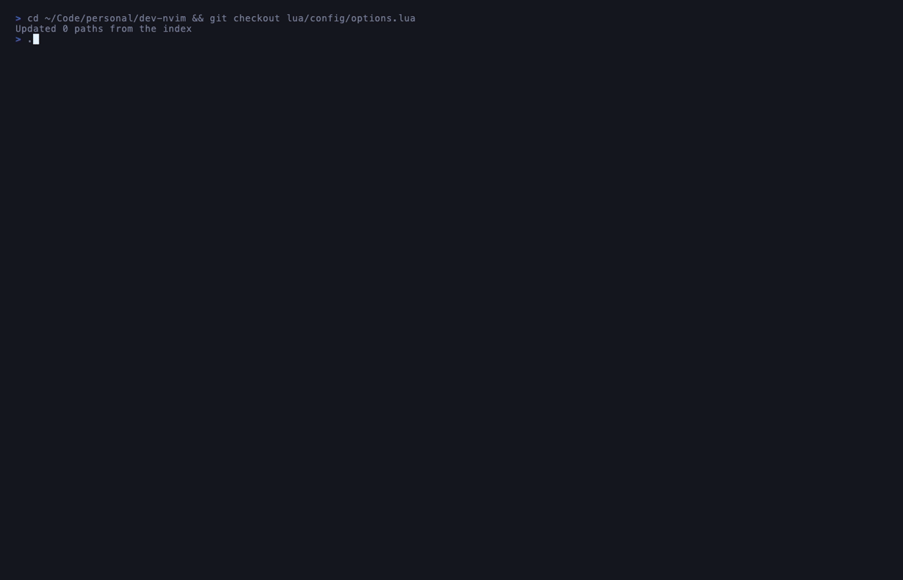
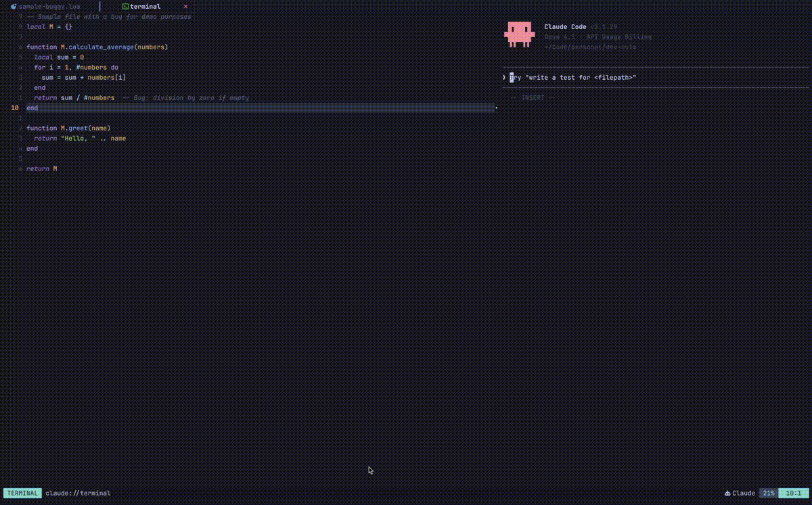

# pair.nvim

> A modern Neovim configuration optimized for AI-assisted development workflows.

<p align="center">
  
</p>

## Quick Start

```bash
curl -fsSL https://raw.githubusercontent.com/mpaarating/pair.nvim/main/install.sh | bash
```

Or clone and run locally:

```bash
git clone https://github.com/mpaarating/pair.nvim.git ~/.dotfiles/nvim
~/.dotfiles/nvim/install.sh
```

---

## Why pair.nvim?

Built for developers who pair program with AI. When Claude Code edits your files, pair.nvim makes it seamless:

- **Auto-reload** — Files update instantly when modified externally. No more "file changed on disk" prompts.
- **Context copying** — `<Space>cc` copies code with file paths and line numbers, formatted for AI.
- **Diff views** — See exactly what changed with `<Space>cd` (unsaved) or `<Space>cD` (vs git).
- **Split-pane workflow** — Run Claude Code alongside your editor with the `ce` command.

---

## AI Pair Programming

The killer feature. Here's the workflow:

<p align="center">
  
</p>

1. **Share context** — Select code, press `<Space>cc`. It copies with `file:line` format that AI understands.
2. **AI edits your file** — Claude Code (or any AI) modifies the file directly.
3. **Auto-reload** — Your buffer updates automatically. No prompts, no manual reload.
4. **Review changes** — Press `<Space>cD` to diff against git and see exactly what changed.
5. **Continue** — Copy the new code, ask follow-up questions, iterate.

### Claude Code Integration

For the ultimate experience, use the `ce` (claude-edit) command to open a file with Claude in a split pane:

```bash
ce src/myfile.ts
```

<p align="center">
  
</p>

| Key | Action |
|-----|--------|
| `<Space>cs` | Send selection to Claude |
| `<C-h>` | Focus editor (left pane) |
| `<C-l>` | Focus Claude (right pane) |
| `<Space>ct` | Toggle Claude pane |

<details>
<summary><strong>Setup Instructions</strong></summary>

1. Install [Claude CLI](https://docs.anthropic.com/en/docs/claude-code)
2. Run the installer and enable claude-edit when prompted
3. Add to your shell profile (`~/.zshrc` or `~/.bashrc`):

```bash
ce() {
  if [[ -z "$1" ]]; then
    echo "Usage: ce <file>"
    return 1
  fi
  CLAUDE_EDIT_CMD="claude" nvim "$1" -c 'lua require("config.claude-edit").setup()'
}
```

4. Reload: `source ~/.zshrc`

</details>

<details>
<summary><strong>Using Other AI CLIs</strong></summary>

The split-pane workflow works with any AI CLI tool. Set `CLAUDE_EDIT_CMD`:

```bash
# For OpenAI Codex CLI
CLAUDE_EDIT_CMD="codex" ce myfile.ts

# For Aider
CLAUDE_EDIT_CMD="aider" ce myfile.ts

# For any other CLI
CLAUDE_EDIT_CMD="your-cli" ce myfile.ts
```

</details>

---

## Features

### Discoverability

Never memorize keybindings. Press `<Space>` and which-key shows you everything. Press `<Space>?` for the full cheatsheet.

<p align="center">
  
</p>

### Navigation

Find files, search code, jump between buffers — all with fuzzy finding.

<p align="center">
  
</p>

| Key | Action |
|-----|--------|
| `<Space>e` | Toggle file explorer |
| `<Space>ff` | Find files |
| `<Space>/` | Live grep (search in files) |
| `<Space>fb` | Browse open buffers |

### Code Intelligence

Full LSP support out of the box — hover docs, go to definition, find references, code actions.

<p align="center">
  
</p>

| Key | Action |
|-----|--------|
| `K` | Hover documentation |
| `gd` | Go to definition |
| `gr` | Find references |
| `<Space>ca` | Code actions |

Supported languages: TypeScript, Python, Lua, Go, Rust, and more via [mason.nvim](https://github.com/williamboman/mason.nvim).

### Git Integration

LazyGit built-in. Stage, commit, push, browse history — without leaving Neovim.

<p align="center">
  
</p>

| Key | Action |
|-----|--------|
| `<Space>gg` | Open LazyGit |
| `<Space>cd` | Diff unsaved changes |
| `<Space>cD` | Diff against git HEAD |

---

## All Key Bindings

Press `<Space>?` for the interactive cheatsheet. Here are the essentials:

| Key | Action |
|-----|--------|
| `<Space>` | Leader key (opens which-key) |
| `<Space>?` | Show cheatsheet |
| `<Space>e` | Toggle file explorer |
| `<Space>ff` | Find files |
| `<Space>/` | Live grep |
| `<Space>gg` | Open LazyGit |
| `<Space>cc` | Copy for AI (with file:line) |
| `<Space>cs` | Send selection to Claude |
| `<Space>cd` | Diff unsaved changes |
| `<Space>cD` | Diff against git HEAD |
| `gd` | Go to definition |
| `gr` | Find references |
| `K` | Hover documentation |
| `<C-s>` | Save file |
| `<C-h/j/k/l>` | Navigate windows |

See [docs/keybindings.md](docs/keybindings.md) for the complete reference.

---

## Customization

Add your own config without modifying core files:

```lua
-- lua/user/init.lua
vim.keymap.set('n', '<leader>x', ':echo "custom"<CR>')
vim.opt.relativenumber = true
```

Add plugins:

```lua
-- lua/user/plugins/my-plugins.lua
return {
  { "tpope/vim-surround" },
}
```

See [docs/customization.md](docs/customization.md) for more.

---

## Requirements

- **Neovim** >= 0.11
- **git**, **Node.js**, **ripgrep**
- **fd** (optional, faster file finding)

<details>
<summary><strong>macOS</strong></summary>

```bash
brew install neovim node ripgrep fd
```

</details>

<details>
<summary><strong>Ubuntu/Debian</strong></summary>

```bash
# Neovim (use latest release, not apt)
curl -LO https://github.com/neovim/neovim/releases/latest/download/nvim-linux64.tar.gz
sudo tar -C /opt -xzf nvim-linux64.tar.gz
sudo ln -sf /opt/nvim-linux64/bin/nvim /usr/local/bin/nvim

# Other dependencies
sudo apt install nodejs npm ripgrep fd-find
```

</details>

---

## Updating

```bash
~/.dotfiles/nvim/update.sh
```

## Uninstalling

```bash
~/.dotfiles/nvim/uninstall.sh
```

---

## Structure

```
pair.nvim/
├── init.lua              # Entry point
├── lua/
│   ├── config/           # Core configuration
│   ├── plugins/          # Plugin specifications
│   └── user/             # Your customizations (gitignored)
└── docs/                 # Documentation
```

## License

MIT
